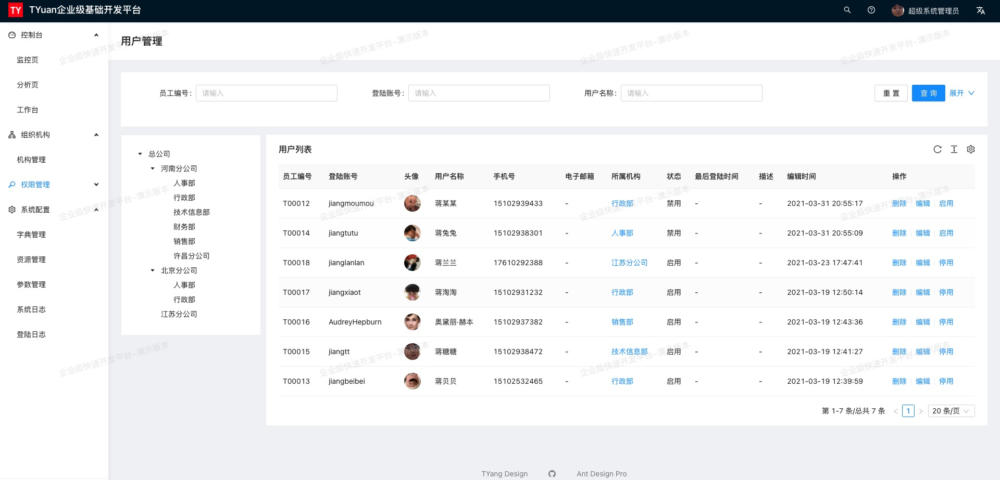

##### 演示地址
* [在线演示](http://base.tyuan.design:6081)
* 账号：admin
* 密码：tyuan

##### 使用文档
* [在线文档](http://tyuan.design/)

##### 整体技术架构
* [前端](https://github.com/j-tyuan/tyuan-web) ：React/ [pro.ant.design](http://pro.ant.design)
* [后端](https://github.com/j-tyuan/tyuan-manager) ：Java/Spring Boot/Mybatis
* 数据库：Mysql
* 中间件：Redis

##### 兼容性
* 支持 Chrome、Safari、Firefox 等现代主流浏览器。

##### 技术支持
* [139672396](https://qm.qq.com/cgi-bin/qm/qr?k=rjUvWB3vTk9tP7pPGgwnmFv4jEacxz3R&jump_from=webapi) （QQ群 - 敏捷开发）

##### 安装运行
    # install dependencies
    yarn install
    
    # serve with hot reload at localhost:8000
    # 必须要配合Api Service，否则登陆无法登陆
    yarn start:no-mock
    
    # build for production with minification
    yarn build
    
    # build path
    cd ./dist
    
##### 特点
* 遵守apache license 2.0 开源协议
* 前后端分离
* 前端支持mock，不依赖后端API开发进度
* 配套的ApiService服务（Java Spring Boot）
* 高颜值，高性能，高可用
* 炼出典型模板/业务组件
* 丰富布局模式
* 内置浅色主题 / 暗黑主题
* 漂亮的 UI、极致的用户体验和细节处理

##### 功能
* 置后台管理系统常用模块
* 登录加密
* 国际化
* 异常处理
* Utils工具包
* 可配置的菜单栏徽标
* 亮色 / 暗色 侧边栏
* 浅色主题 / 暗黑主题
* 丰富的个性化配置
* 代码编辑器
* 可折叠侧边栏
* 支持内嵌页面
* 重载当前页面
* 动态路由支持自动重载
* 支持多级路由嵌套及菜单栏嵌套
* 分离路由与菜单*__*设置
* 优秀的持久化存储方案
* 自定义登录重定向

##### 权限
* 路由级别鉴权
* 侧边栏菜单鉴权
* 功能块鉴权
* 功能点鉴权
* 鉴权指令

# 部署方式：

##### Nginx （推荐使用：Tengine）:
    server {
            listen 8848;
    
            root /var/tendim/manager/dist;
            index index.html index.htm;
    
            location / {
                    try_files $uri $uri/ /index.html;
            }
            location ^~ /assets/ {
                    gzip_static on;
                    expires max;
                    add_header Cache-Control public;
            }
             location ^~ /api/ {
              proxy_pass http://127.0.0.1:8080;
            }
            error_page 500 502 503 504 /500.html;
            client_max_body_size 20M;
            keepalive_timeout 10;
    } 

##### 关于给JS/CSS优化:

    # /etc/nginx/nginx.conf
    http {
       .....
       # 开启优化
       gzip                on;
       #低于1kb的资源不压缩，
       gzip_min_length     1024;
       #压缩级别【1-9】，越大压缩率越高，同时消耗cpu资源也越多，建议设置在4左右
       gzip_comp_level     3;
       #需要压缩哪些响应类型的资源，多个空格隔开。不建议压缩图片
       gzip_types         text/plain application/x-javascript application/javascript text/css application/xml text/javascript application/x-httpd-php image/jpeg image/gif image/png;
       #配置禁用gzip条件，支持正则。此处表示ie6及以下不启用gzip（因为ie低版本不支持）
       gzip_disable "MSIE [1-6]\.";
       #是否添加“Vary: Accept-Encoding”响应头
       gzip_vary off;
       ........
    }

##### 测试优化
    curl -I -H "Accept-Encoding: gzip, deflate" "http://base.tyuan.design/?????.js"
    
    HTTP/1.1 200 OK
    Server: nginx/1.16.1
    Date: Fri, 19 Mar 2021 08:14:17 GMT
    Content-Type: application/javascript
    Last-Modified: Fri, 19 Mar 2021 04:59:34 GMT
    Connection: keep-alive
    ETag: W/"60542fb6-1e7709"
    Expires: Thu, 31 Dec 2037 23:55:55 GMT
    Cache-Control: max-age=315360000
    Cache-Control: public
    Content-Encoding: gzip   <------ 返回则代表配置成功

##### 配置在客户端缓存时间
    #意思是当用户访问ur结尾的文件扩展名为上述指定类型的图片时,设置缓存3650天,即1年.
    location ~.*\.(git|jpg|jpeg|png|bmp|swf)$ { 
            expires 2650d;  
    }
    
    #意思是当前用户访问网站url结尾的文件扩展名为js,css类型元素进,设置存存30天.
    location ~ .*\.(js|css)?$ {
              expires 30d;   
    }
